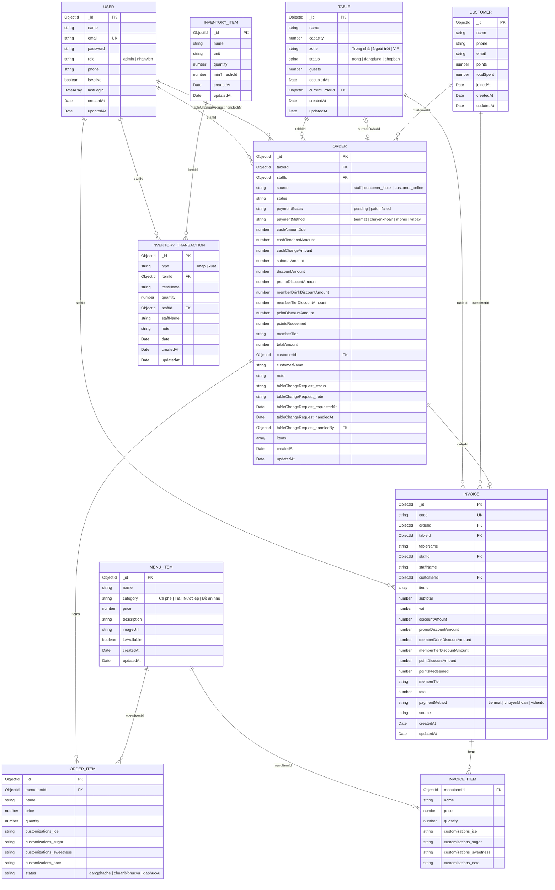

# Bloom Coffee - Database ERD Export

Tài liệu này mô tả cấu trúc database hiện tại của Bloom Coffee dựa trên các Mongoose model trong `server/src/models`.

> Lưu ý: Dự án đang dùng MongoDB, nhưng vẫn có thể vẽ ERD logic bằng cách xem mỗi collection như một entity và các trường `ObjectId ref` như quan hệ giữa các entity.

## Collections

| Collection | Model | Mục đích |
| --- | --- | --- |
| `users` | `User` | Tài khoản admin/nhân viên |
| `tables` | `Table` | Bàn trong quán |
| `menuitems` | `MenuItem` | Món trong thực đơn |
| `orders` | `Order` | Đơn gọi món |
| `invoices` | `Invoice` | Hóa đơn đã tạo |
| `customers` | `Customer` | Khách hàng thân thiết |
| `inventoryitems` | `InventoryItem` | Nguyên liệu/tồn kho |
| `inventorytransactions` | `InventoryTransaction` | Lịch sử nhập/xuất kho |

## Mermaid ERD

Bạn có thể copy đoạn dưới vào Markdown hỗ trợ Mermaid hoặc dùng trực tiếp trên GitHub.

## Quan hệ chính

| Quan hệ | Ý nghĩa |
| --- | --- |
| `Order.staffId -> User._id` | Nhân viên tạo/xử lý đơn |
| `Order.tableId -> Table._id` | Đơn thuộc về bàn nào |
| `Order.customerId -> Customer._id` | Đơn gắn với khách hàng thân thiết nếu có |
| `Order.items.menuItemId -> MenuItem._id` | Món trong đơn tham chiếu thực đơn |
| `Order.tableChangeRequest.handledBy -> User._id` | Nhân viên tiếp nhận yêu cầu đổi chỗ |
| `Table.currentOrderId -> Order._id` | Bàn đang gắn với đơn hiện tại |
| `Invoice.orderId -> Order._id` | Hóa đơn được tạo từ đơn |
| `Invoice.tableId -> Table._id` | Hóa đơn thuộc bàn nào |
| `Invoice.staffId -> User._id` | Nhân viên tạo hóa đơn |
| `Invoice.customerId -> Customer._id` | Hóa đơn gắn với khách hàng thân thiết nếu có |
| `Invoice.items.menuItemId -> MenuItem._id` | Món trong hóa đơn tham chiếu thực đơn |
| `InventoryTransaction.itemId -> InventoryItem._id` | Giao dịch nhập/xuất thuộc nguyên liệu nào |
| `InventoryTransaction.staffId -> User._id` | Nhân viên thực hiện giao dịch kho |

## Gợi ý khi vẽ ERD cho đồ án SQL

Nếu yêu cầu đồ án bắt buộc trình bày theo SQL, có thể quy đổi logic như sau:

- Mỗi MongoDB collection tương ứng một bảng SQL.
- Mỗi `_id` tương ứng khóa chính.
- Mỗi trường `ObjectId ref` tương ứng khóa ngoại.
- Các mảng nhúng như `Order.items` và `Invoice.items` nên tách thành bảng phụ:
  - `order_items`
  - `invoice_items`
- Các object nhúng như `tableChangeRequest` có thể để chung trong bảng `orders` vì đây là thông tin trạng thái của một đơn.
